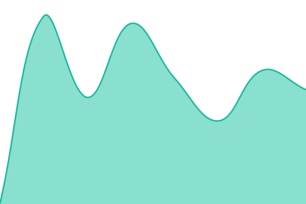
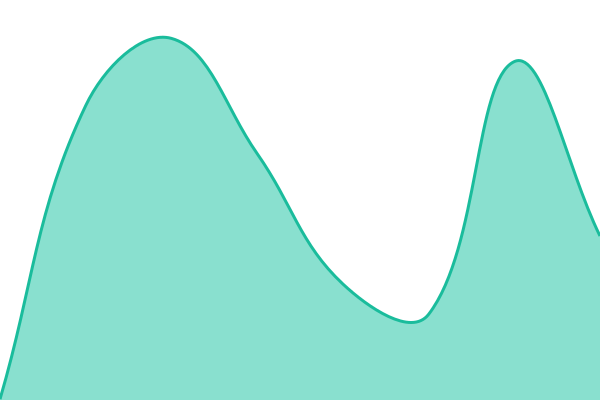
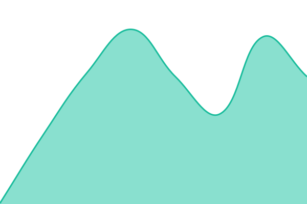

# [📈 Live Status](https://conscherry.github.io/status): <!--live status--> **🟩 All systems operational**

This repository contains the open-source uptime monitor and status page for [Conscherry](https://conscherry.com), powered by [Upptime](https://github.com/upptime/upptime).

With [Upptime](https://upptime.js.org), you can get your own unlimited and free uptime monitor and status page, powered entirely by a GitHub repository. We use [Issues](https://github.com/conscherry/status/issues) as incident reports, [Actions](https://github.com/conscherry/status/actions) as uptime monitors, and [Pages](https://conscherry.github.io/status) for the status page.

<!--start: status pages-->
<!-- This summary is generated by Upptime (https://github.com/upptime/upptime) -->
<!-- Do not edit this manually, your changes will be overwritten -->
<!-- prettier-ignore -->
| URL | Status | History | Response Time | Uptime |
| --- | ------ | ------- | ------------- | ------ |
|  [API Services](https://conscherry.com/api/health) | 🟩 Up | [api-services.yml](https://github.com/conscherry/status/commits/HEAD/history/api-services.yml) | 

 209ms
     
 | 

<a href="https://status.conscherry.com/history/api-services">100.00%</a>
    

|  [Conscherry](https://conscherry.com) | 🟩 Up | [conscherry.yml](https://github.com/conscherry/status/commits/HEAD/history/conscherry.yml) | 

 413ms
     
 | 

<a href="https://status.conscherry.com/history/conscherry">100.00%</a>
    

|  [Conscherry Dashboard](https://dashboard.conscherry.com) | 🟩 Up | [conscherry-dashboard.yml](https://github.com/conscherry/status/commits/HEAD/history/conscherry-dashboard.yml) | 

 351ms
     
 | 

<a href="https://status.conscherry.com/history/conscherry-dashboard">100.00%</a>
    

|  [Helpdesk](https://helpdesk.conscherry.com/) | 🟩 Up | [helpdesk.yml](https://github.com/conscherry/status/commits/HEAD/history/helpdesk.yml) | 

 279ms
     
 | 

<a href="https://status.conscherry.com/history/helpdesk">100.00%</a>
    

|  [Indenti Project](https://indenti.net) | 🟩 Up | [indenti-project.yml](https://github.com/conscherry/status/commits/HEAD/history/indenti-project.yml) | 

 195ms
     
 | 

<a href="https://status.conscherry.com/history/indenti-project">100.00%</a>
    

|  KindBot Health | 🟩 Up | [kind-bot-health.yml](https://github.com/conscherry/status/commits/HEAD/history/kind-bot-health.yml) | 

 211ms
     
 | 

<a href="https://status.conscherry.com/history/kind-bot-health">100.00%</a>
    

|  [Labs API Services](https://labs.conscherry.com/api/health) | 🟩 Up | [labs-api-services.yml](https://github.com/conscherry/status/commits/HEAD/history/labs-api-services.yml) | 

 799ms
     
 | 

<a href="https://status.conscherry.com/history/labs-api-services">100.00%</a>
    

|  [Labs Project](https://labs.conscherry.com/) | 🟩 Up | [labs-project.yml](https://github.com/conscherry/status/commits/HEAD/history/labs-project.yml) | 

 2008ms
     
 | 

<a href="https://status.conscherry.com/history/labs-project">100.00%</a>
    

|  Project Host | 🟩 Up | [project-host.yml](https://github.com/conscherry/status/commits/HEAD/history/project-host.yml) | 

 65ms
     
 | 

<a href="https://status.conscherry.com/history/project-host">98.46%</a>
    

|  [The Gobble Project](https://playgobble.xyz) | 🟩 Up | [the-gobble-project.yml](https://github.com/conscherry/status/commits/HEAD/history/the-gobble-project.yml) | 

 869ms
     
 | 

<a href="https://status.conscherry.com/history/the-gobble-project">100.00%</a>
    

<!--end: status pages-->

[**Visit our status website →**](https://conscherry.github.io/status)

## 📄 License

- Powered by: [Upptime](https://github.com/upptime/upptime)
- Code: [MIT](./LICENSE) © [Anand Chowdhary](https://anandchowdhary.com)
- Data in the `./history` directory: [Open Database License](https://opendatacommons.org/licenses/odbl/1-0/)
