# [📈 Live Status](https://conscherry.github.io/status): <!--live status--> **🟧 Partial outage**

This repository contains the open-source uptime monitor and status page for [Conscherry](https://conscherry.com), powered by [Upptime](https://github.com/upptime/upptime).

With [Upptime](https://upptime.js.org), you can get your own unlimited and free uptime monitor and status page, powered entirely by a GitHub repository. We use [Issues](https://github.com/conscherry/status/issues) as incident reports, [Actions](https://github.com/conscherry/status/actions) as uptime monitors, and [Pages](https://conscherry.github.io/status) for the status page.

<!--start: status pages-->
<!-- This summary is generated by Upptime (https://github.com/upptime/upptime) -->
<!-- Do not edit this manually, your changes will be overwritten -->
<!-- prettier-ignore -->
| URL | Status | History | Response Time | Uptime |
| --- | ------ | ------- | ------------- | ------ |
|  [API Services](https://conscherry.com/api/health) | 🟩 Up | [api-services.yml](https://github.com/conscherry/status/commits/HEAD/history/api-services.yml) | 

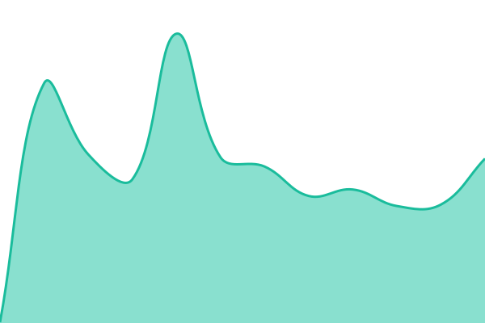 200ms
     
 | 

<a href="https://status.conscherry.com/history/api-services">100.00%</a>
    

|  [API Services (Europe)](https://conscherry.com/api/health) | 🟩 Up | [api-services-eu.yml](https://github.com/conscherry/status/commits/HEAD/history/api-services-eu.yml) | 

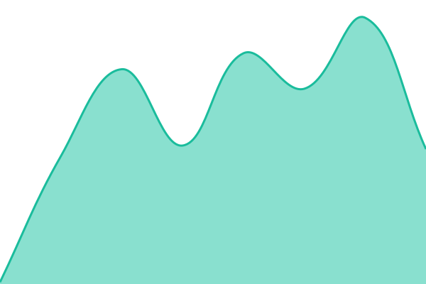 292ms
     
 | 

<a href="https://status.conscherry.com/history/api-services-eu">100.00%</a>
    

|  [API Services (Asia)](https://conscherry.com/api/health) | 🟩 Up | [api-services-as.yml](https://github.com/conscherry/status/commits/HEAD/history/api-services-as.yml) | 

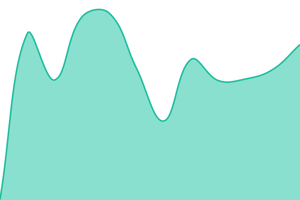 303ms
     
 | 

<a href="https://status.conscherry.com/history/api-services-as">100.00%</a>
    

|  [REST API](https://api.conscherry.com/health) | 🟩 Up | [rest-api.yml](https://github.com/conscherry/status/commits/HEAD/history/rest-api.yml) | 

 267ms
     
 | 

<a href="https://status.conscherry.com/history/rest-api">100.00%</a>
    

|  [Conscherry](https://conscherry.com) | 🟩 Up | [conscherry.yml](https://github.com/conscherry/status/commits/HEAD/history/conscherry.yml) | 

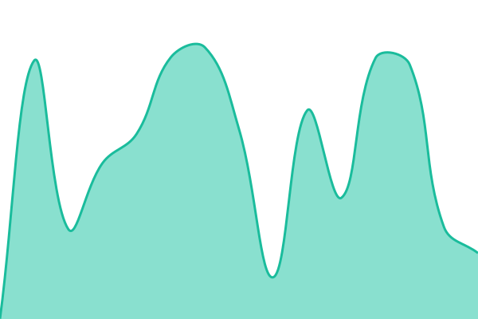 325ms
     
 | 

<a href="https://status.conscherry.com/history/conscherry">100.00%</a>
    

|  [Conscherry (Europe)](https://conscherry.com) | 🟩 Up | [conscherry-eu.yml](https://github.com/conscherry/status/commits/HEAD/history/conscherry-eu.yml) | 

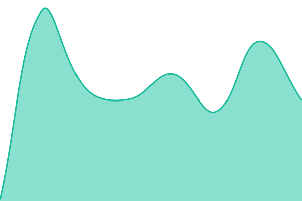 320ms
     
 | 

<a href="https://status.conscherry.com/history/conscherry-eu">100.00%</a>
    

|  [Conscherry (Asia)](https://conscherry.com) | 🟩 Up | [conscherry-as.yml](https://github.com/conscherry/status/commits/HEAD/history/conscherry-as.yml) | 

 312ms
     
 | 

<a href="https://status.conscherry.com/history/conscherry-as">100.00%</a>
    

|  [Dashboard](https://dashboard.conscherry.com) | 🟩 Up | [dashboard.yml](https://github.com/conscherry/status/commits/HEAD/history/dashboard.yml) | 

 272ms
     
 | 

<a href="https://status.conscherry.com/history/dashboard">100.00%</a>
    

|  [Helpdesk](https://helpdesk.conscherry.com/) | 🟩 Up | [helpdesk.yml](https://github.com/conscherry/status/commits/HEAD/history/helpdesk.yml) | 

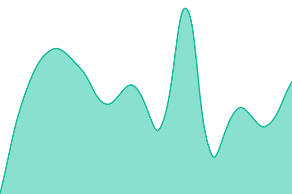 315ms
     
 | 

<a href="https://status.conscherry.com/history/helpdesk">100.00%</a>
    

|  [Hub Platform](https://hub.conscherry.com) | 🟩 Up | [hub-platform.yml](https://github.com/conscherry/status/commits/HEAD/history/hub-platform.yml) | 

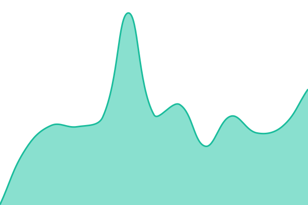 247ms
     
 | 

<a href="https://status.conscherry.com/history/hub-platform">100.00%</a>
    

|  [Indenti Platform](https://indenti.net) | 🟩 Up | [indenti-platform.yml](https://github.com/conscherry/status/commits/HEAD/history/indenti-platform.yml) | 

 208ms
     
 | 

<a href="https://status.conscherry.com/history/indenti-platform">100.00%</a>
    

|  [Indenti Portal](https://portal.indenti.net) | 🟩 Up | [indenti-portal.yml](https://github.com/conscherry/status/commits/HEAD/history/indenti-portal.yml) | 

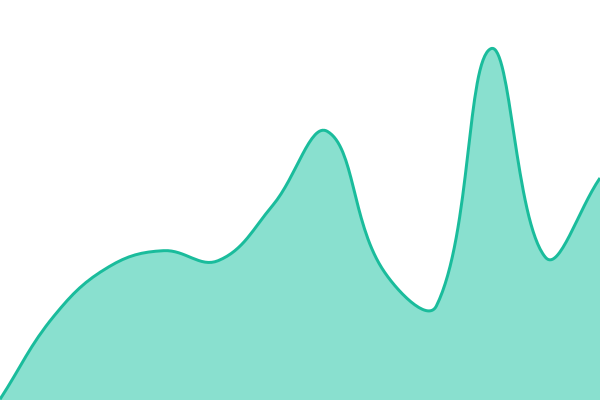 258ms
     
 | 

<a href="https://status.conscherry.com/history/indenti-portal">100.00%</a>
    

|  KindBot Project | 🟩 Up | [kind-bot-project.yml](https://github.com/conscherry/status/commits/HEAD/history/kind-bot-project.yml) | 

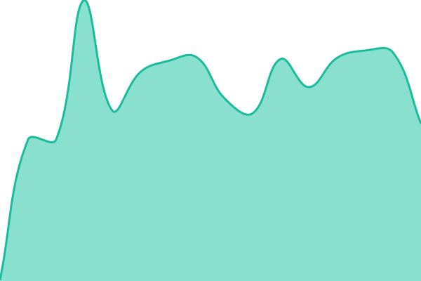 215ms
     
 | 

<a href="https://status.conscherry.com/history/kind-bot-project">97.79%</a>
    

|  Labs API Services | 🟩 Up | [labs-api-services.yml](https://github.com/conscherry/status/commits/HEAD/history/labs-api-services.yml) | 

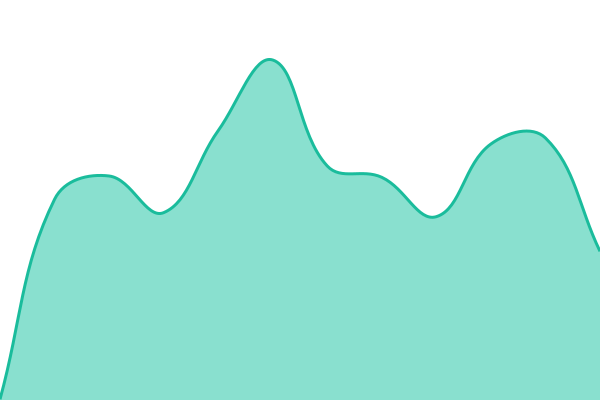 302ms
     
 | 

<a href="https://status.conscherry.com/history/labs-api-services">100.00%</a>
    

|  Labs Bot | 🟥 Down | [labs-bot.yml](https://github.com/conscherry/status/commits/HEAD/history/labs-bot.yml) | 

 231ms
     
 | 

<a href="https://status.conscherry.com/history/labs-bot">86.57%</a>
    

|  [Labs Project](https://labs.conscherry.com/) | 🟩 Up | [labs-project.yml](https://github.com/conscherry/status/commits/HEAD/history/labs-project.yml) | 

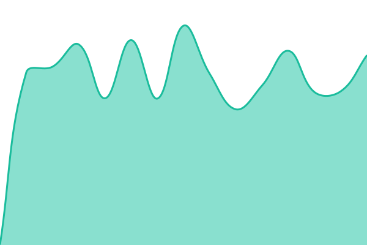 469ms
     
 | 

<a href="https://status.conscherry.com/history/labs-project">100.00%</a>
    

|  [Labs Project (Europe)](https://labs.conscherry.com/) | 🟩 Up | [labs-project-eu.yml](https://github.com/conscherry/status/commits/HEAD/history/labs-project-eu.yml) | 

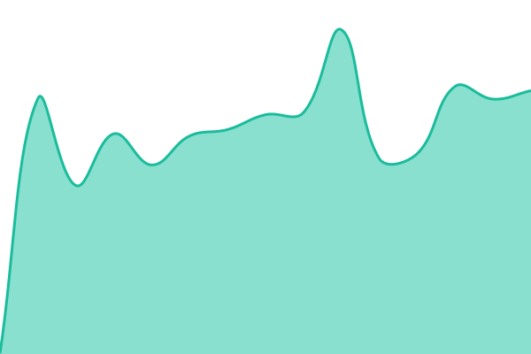 299ms
     
 | 

<a href="https://status.conscherry.com/history/labs-project-eu">100.00%</a>
    

|  [Labs Project (Asia)](https://labs.conscherry.com/) | 🟩 Up | [labs-project-as.yml](https://github.com/conscherry/status/commits/HEAD/history/labs-project-as.yml) | 

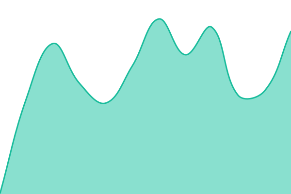 322ms
     
 | 

<a href="https://status.conscherry.com/history/labs-project-as">100.00%</a>
    

|  Launcher Project | 🟩 Up | [launcher-project.yml](https://github.com/conscherry/status/commits/HEAD/history/launcher-project.yml) | 

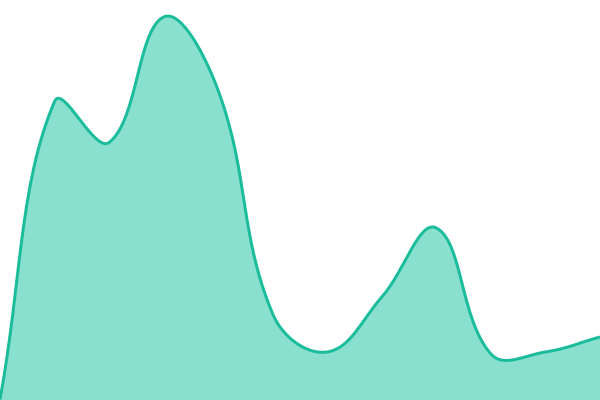 137ms
     
 | 

<a href="https://status.conscherry.com/history/launcher-project">100.00%</a>
    

|  Moneta Project | 🟥 Down | [moneta-project.yml](https://github.com/conscherry/status/commits/HEAD/history/moneta-project.yml) | 

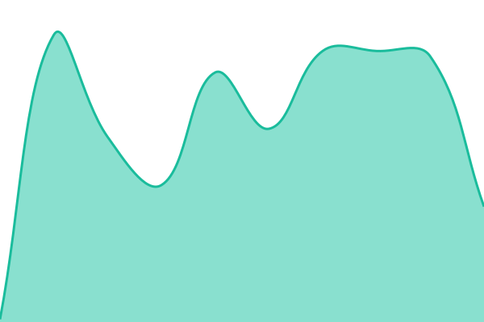 83ms
     
 | 

<a href="https://status.conscherry.com/history/moneta-project">70.27%</a>
    

|  [The Gobble Project](https://playgobble.xyz) | 🟩 Up | [the-gobble-project.yml](https://github.com/conscherry/status/commits/HEAD/history/the-gobble-project.yml) | 

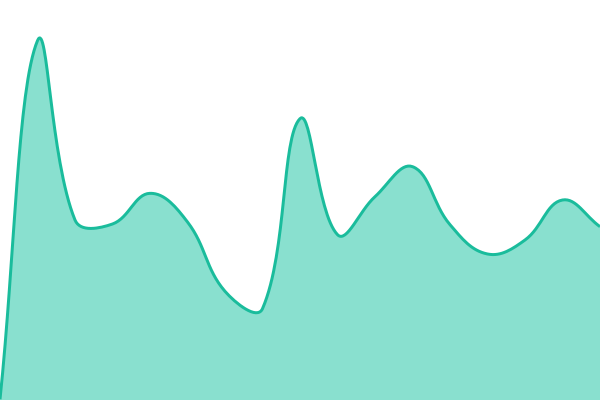 331ms
     
 | 

<a href="https://status.conscherry.com/history/the-gobble-project">100.00%</a>
    

|  [The Gobble Project (Europe)](https://playgobble.xyz) | 🟩 Up | [the-gobble-project-eu.yml](https://github.com/conscherry/status/commits/HEAD/history/the-gobble-project-eu.yml) | 

 385ms
     
 | 

<a href="https://status.conscherry.com/history/the-gobble-project-eu">100.00%</a>
    

|  [The Gobble Project (Asia)](https://playgobble.xyz) | 🟩 Up | [the-gobble-project-as.yml](https://github.com/conscherry/status/commits/HEAD/history/the-gobble-project-as.yml) | 

 315ms
     
 | 

<a href="https://status.conscherry.com/history/the-gobble-project-as">100.00%</a>
    

|  VPS Monitor | 🟥 Down | [vps-monitor.yml](https://github.com/conscherry/status/commits/HEAD/history/vps-monitor.yml) | 

 478ms
     
 | 

<a href="https://status.conscherry.com/history/vps-monitor">68.07%</a>
    

<!--end: status pages-->

[**Visit our status website →**](https://conscherry.github.io/status)

## 📄 License

- Powered by: [Upptime](https://github.com/upptime/upptime)
- Code: [MIT](./LICENSE) © [Anand Chowdhary](https://anandchowdhary.com)
- Data in the `./history` directory: [Open Database License](https://opendatacommons.org/licenses/odbl/1-0/)
